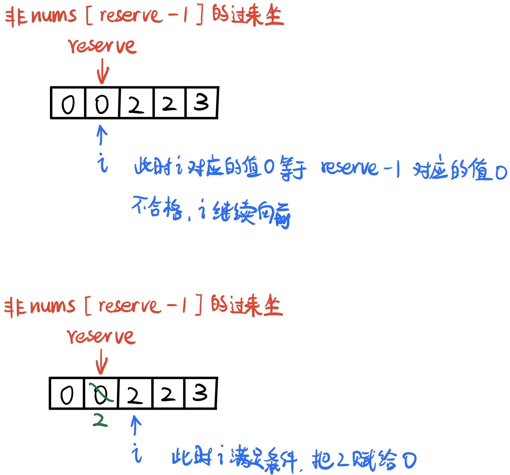
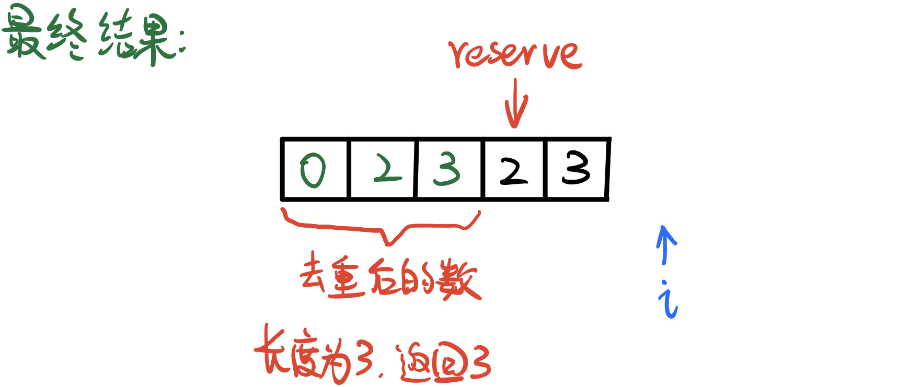

# \[Leetcode\]26. Remove Duplicates from Sorted Array

原题地址：[https://leetcode.com/problems/remove-duplicates-from-sorted-array/](https://leetcode.com/problems/remove-duplicates-from-sorted-array/) 关键词：Two pointer

题意：去除数组中重复数；  
已经sorted数组`nums[]`中，去除`nums[]`中所有重复的数字（让重复的数字只出现一次）；  
返回：去除重复后数组左边的长度length；  
（要求做到Space Optimal，不能另外创建新数组，只能在原数组上操作）

例：  
Input: `nums = [0, 0, 1, 1, 1, 2, 2, 3, 3, 4]`  
Output: `5, nums = [0, 1, 2, 3, 4, _, _, _, _, _]`  
解释：去除重复数字后，数组左边的有效长度为5


### 此类题统一思路模板：

1. 用指针reserve去reserve有效起始位置，同时要确定：满足什么样的条件才能占据这个位置；
2. 用第二个指针`i`去遍历给定数组nums的每一个元素；
3. 一旦当前指针`i`扫到的元素`nums[i]`满足reserve位置的要求，那么就赋值`nums[reserve] = nums[i]`；


### 将模板代入本题算法：

●**reserve起始位置：**第二个数\(index 1\)；  
为什么从第二个数字开始？因为检查duplicate，第一个数字\(index 0\)是第一次出现，绝对不可能重复，所以我们从第二个数字开始扫描；

●**需要满足的条件：**出现不超过一次；  
如何检查？只要指数`i`对应的数，与`reserve - 1`对应的数相等，则表明有duplicate；

若没有duplicate，则赋值`nums[reserve] = nums[i]`，然后`reserve++`；

详细图解：






```text
class Solution {
    public int removeDuplicates(int[] nums) {
        if (nums == null || nums.length == 0) return 0;
        
        int reserve = 1;
        
        for (int i = 1; i < nums.length; i++) {
            if (nums[i] != nums[reserve - 1]) { //注意
                nums[reserve] = nums[i];
                reserve++;
            }
        }
        
        return reserve;
    }
}
```

代码结构：  
1. 初始化reserve的值；  
2. for循环  
3. 判断if，如果满足就`nums[reserve] = nums[i]`然后reserve++；

Time: O\(n\);  
Space: O\(1\);

