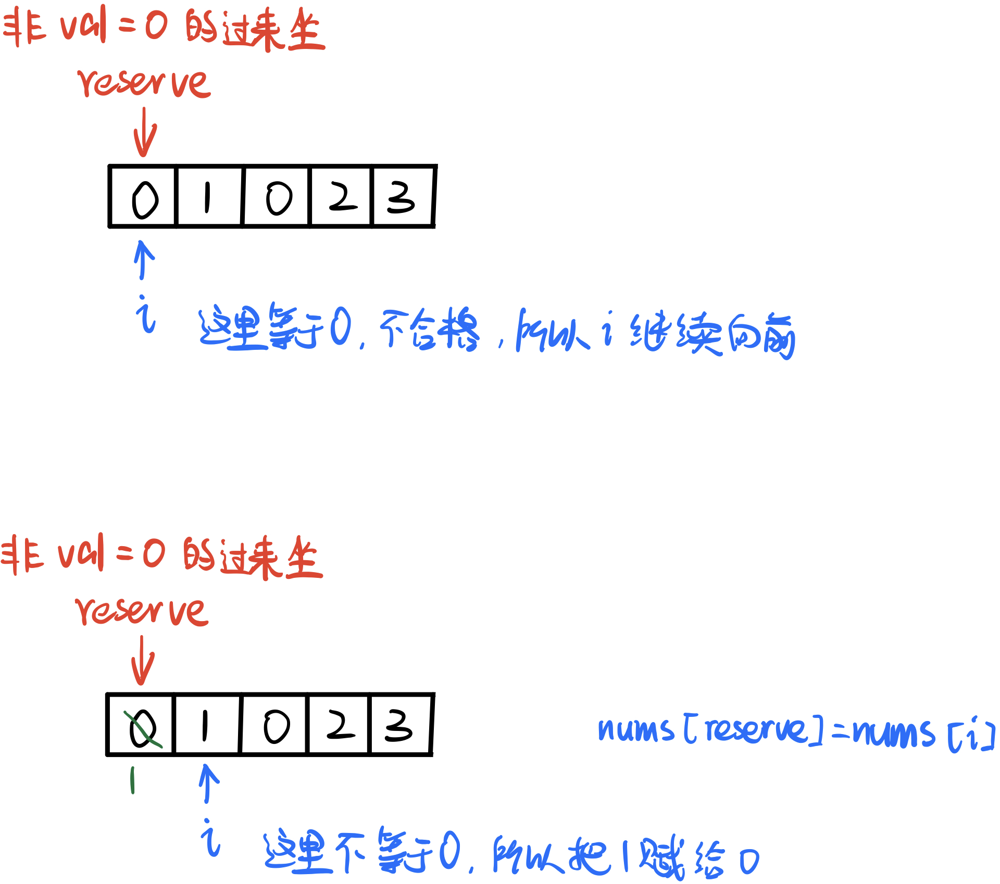
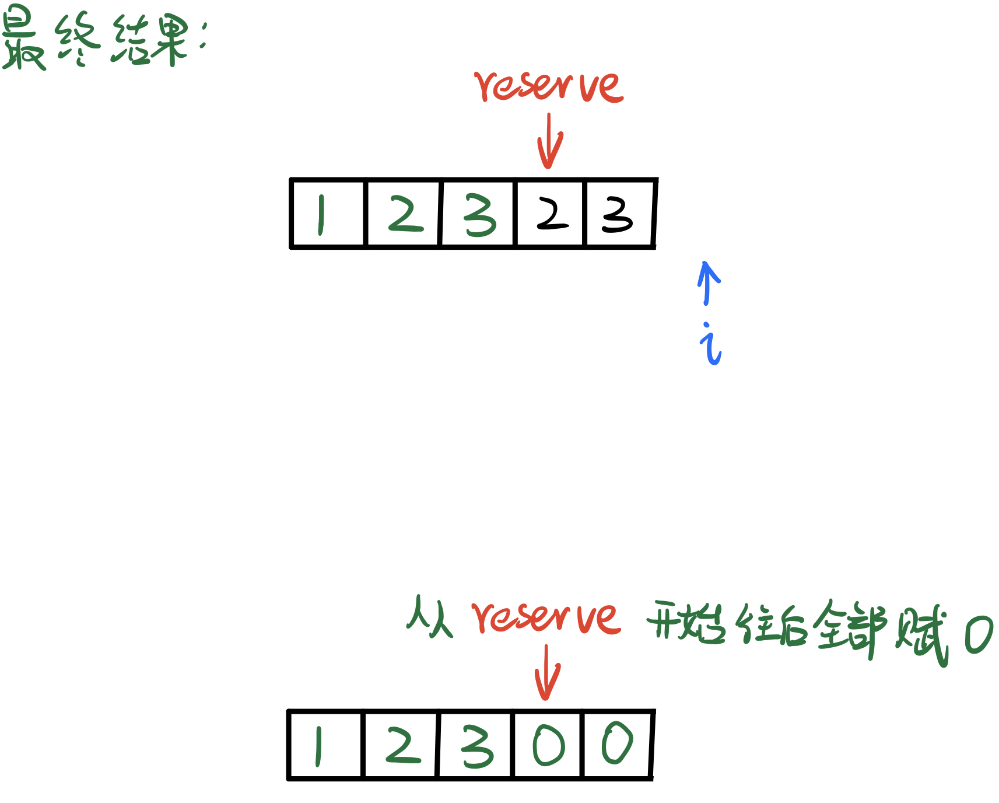

# \[Leetcode\]283. Move Zeroes

原题地址：[https://leetcode.com/problems/move-zeroes/](https://leetcode.com/problems/move-zeroes/) 关键词：Two pointer

题意：一个整数array，把所有的0移到右边，其余数左移且顺序不变  
`Input: nums = [0, 1, 0, 3, 12]   
Output: [1, 3, 12, 0, 0]`  
（要求做到Space Optimal，不能另外创建新数组，只能在原数组上操作）


### 此类题统一思路模板：

1. 用指针reserve去reserve有效起始位置，同时要确定：满足什么样的条件才能占据这个位置；
2. 用第二个指针`i`去遍历给定数组nums的每一个元素；
3. 一旦当前指针`i`扫到的元素`nums[i]`满足reserve位置的要求，那么就赋值`nums[reserve] = nums[i]`；


### 将模板代入本题算法：

●**reserve起始位置：**第一个数\(index 0\)；  
●**需要满足的条件：**值不等于0；

若满足条件，则赋值`nums[reserve] = nums[i]`，然后`reserve++`；

最后，再一次遍历数组，从reserve开始到末尾，全部赋值0即可；

详细图解：






```text
class Solution {
    public void moveZeroes(int[] nums) {
        if (nums == null || nums.length == 0) return; //null check
        
        int reserve = 0;
        
        for (int i = 0; i < nums.length; i++) { //不为0的挨个排到原数组左边 
            if (nums[i] != 0) {
                nums[reserve] = nums[i];
                reserve++;
            }
        }
        
        for (int i = reserve; i < nums.length; i++) { //指数reserve右边全部填上0
            nums[i] = 0;
        }
    }
}
```

代码结构：  
1. 初始化reserve的值；  
2. for循环  
3. 判断if，如果满足就`nums[reserve] = nums[i]`然后reserve++；  
4. 遍历结束后reserve右边赋值0；

Time: O\(n\);  
Space: O\(1\);

