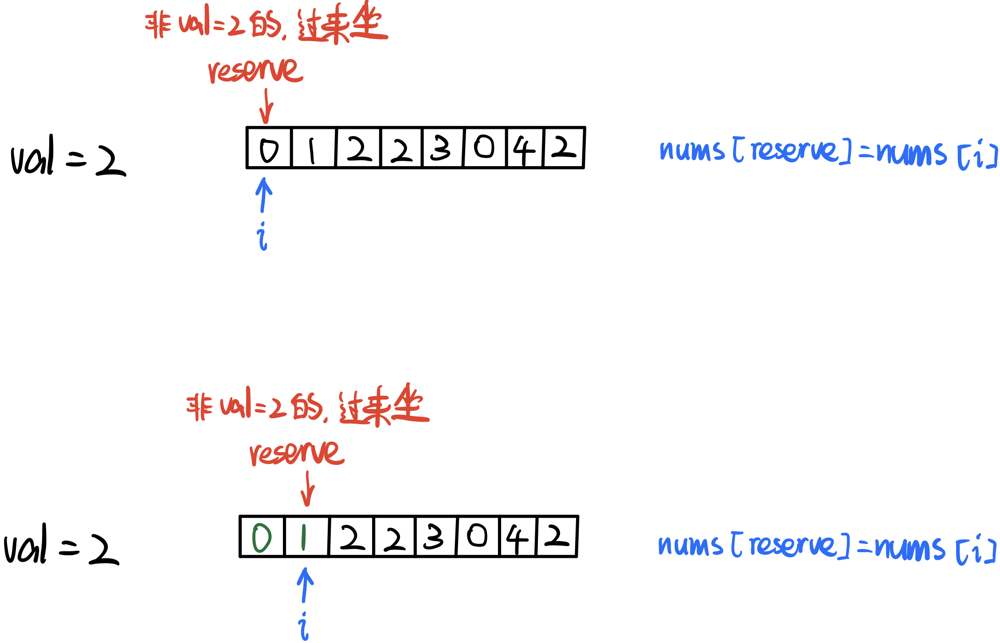
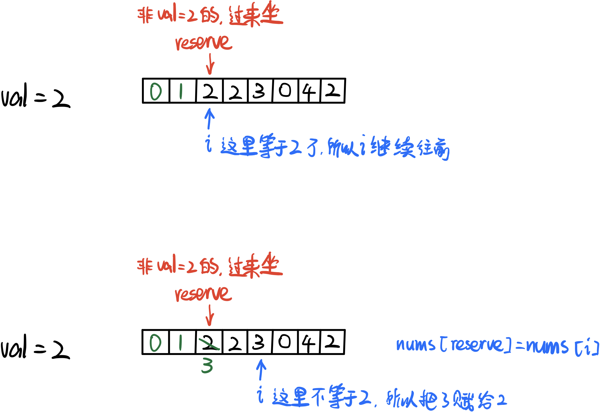
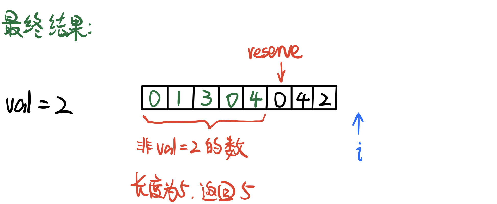

# \[Leetcode\]27. Remove Element\(同类题总结\)

原题地址：[https://leetcode.com/problems/remove-element/](https://leetcode.com/problems/remove-element/) 关键词：Two pointer

题意：去除数组中等于val的数；  
在一个unsorted数组`nums[]`中，给一个整数val，去除`nums[]`中所有等于val的数字，并把其他所有不等于val的数字依次放到数组最左边，右边不用管；  
返回：去除val后数组左边的长度length；  
（要求做到Space Optimal，不能另外创建新数组，只能在原数组上操作）

例：  
Input: `nums = [0, 1, 2, 2, 3, 0, 4, 2], val = 2`   
Output: `5, nums = [0, 1, 3, 0, 4, _, _, _]`   
解释：去除掉数组所有等于2的数之后，数组左边的有效长度为5


### 此类题统一思路模板：

1. 用指针reserve去reserve有效起始位置，同时要确定：满足什么样的条件才能占据这个位置；
2. 用第二个指针`i`去遍历给定数组nums的每一个元素；
3. 一旦当前指针`i`扫到的元素`nums[i]`满足reserve位置的要求，那么就赋值`nums[reserve] = nums[i]`；


### 将模板代入本题算法：

●**reserve起始位置：**第一个数\(index 0\)  
●**需要满足的条件：**值不等于2

若满足条件，则赋值`nums[reserve] = nums[i]`，然后`reserve++`；

详细图解：









```text
class Solution {
    public int removeElement(int[] nums, int val) {
        if (nums == null || nums.length == 0) return 0;
        
        int reserve = 0;
        
        for (int i = 0; i < nums.length; i++) {
            if (nums[i] != val) {
                nums[reserve] = nums[i];
                reserve++;
            }
        }
        
        return reserve;
    }
}
```

代码结构：  
1. 初始化reserve的值；  
2. for循环  
3. 判断if，如果满足就`nums[reserve] = nums[i]`然后reserve++；

Time: O\(n\);  
Space: O\(1\);

