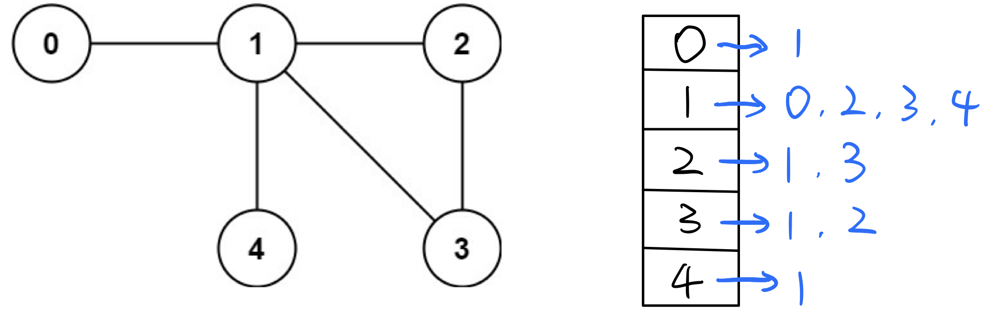

# 无向图中检查环 Detect cycle in a undirected graph

### 怎样检测一个无向图undirected graph里是否有环？？

假设一个图有n = 5个节点，给出一个`edges = [[0,1],[1,2],[2,3],[1,3],[1,4]]`，做出下图。肉眼可以观察到有一个`1 -> 2 -> 3 -> 1`组成的cycle，但是怎样用程序来鉴别呢？


有两种方法，第一种方法是DFS，第二种方法是Union find；我们先研究第一种方法。

## 方法一：构建Adjacency list，用DFS检查环cycle/loop

### 第一个问题：怎样记录和表示一个无向图？

要注意的是，无向图中所有的边都是双向的\(**All edges are bidirectional！**\)，所以我们需要一个数据结构能记录每个点，以及和每个点所有相连接的点。

我们可以用一个**Adjacency List**来记录（也就是一个二维的ArrayList）：  
★`List<List<Integer>> adjList = new ArrayList<>();`

其中，Adjacency List的指数index为图的n个节点；  
            Adjacency List的子List记录**与当前节点所有所有相连接的点；**

那么上面的无向图就可以表示为：  
`0 : [1],   
1 : [0, 2, 3, 4],   
2 : [1, 3],   
3 : [1, 2],   
4 : [1]`



```text
       // 1. initialize adjacency list
       
        List<List<Integer>> adjList = new ArrayList<>();
        
        for (int i = 0; i < n; i++) { //注意这里是n
            adjList.add(i, new ArrayList<Integer>());
        }


        // 2. Add edges
        
        for (int i = 0; i < edges.length; i++) {
            adjList.get(edges[i][0]).add(edges[i][1]);
            adjList.get(edges[i][1]).add(edges[i][0]);
        }
```

**要记住的东西：**

1. 构建Adjacency List的时候，要事先给每个节点new一个ArrayList，不然会报错；
2. 在Add edges的时候，因为是无向图是**bidirectional**的，所以两头都要加；比如`edge[1,2]`，1与2相连的同时意味着2也与1相连，所以把2加入1的Adjacency List的同时也要把1加入2的Adjacency List；

#### 

### 第二个问题，怎样Detect loop/cycle？

我们初始化一个boolean的数组，长度为node的总数n：`boolean[] visited = new boolean[n];`（boolean的初始值默认都是false）

这个`visited[]`boolean数组用来记录我们遍历已经访问过的node；

**算法：**使用DFS

1. 首先构建Adjacency List；
2. 从Adjacency List里第一个点开始DFS，把走过的节点都在`visited[]`里标记true；
3. 在DFS时如果遇到true，说明已经访问过，说明有loop/cycle；
4. 在DFS的同时，我们要用一个int来记录parent node，比如在DFS进入到节点1的时候，0是1的parent node，但1的Adjacency List是`[0, 2, 3, 4]`包含了0，所以我们在对1的Adjacency List遍历DFS的时候，要加入一个判断条件，只有当current node不等于parent node的时候我们才进行DFS，如果current node等于parent node那就跳过它；起始点0的parent node我们设置为-1，然后DFS下一个节点的时候把当前current node设置为下一个节点的parent node；（参见代码40行）

★注意上面第四点，是与[有向图directed graph检查环](https://bhnigw.gitbook.io/leetcode/ji-chu-bi-hui/detect-cycle-in-a-directed-graph)最大的区别：directed graph的子节点中不包含parent node（因为是有方向的），所以不用检查。而undirected graph子节点里包含parent node所以必须检查；

```text
class Solution {
    public boolean detectCycle(int n, int[][] edges) {
        
        // initialize adjacency list
        List<List<Integer>> adjList = new ArrayList<>();
        for (int i = 0; i < n; i++) { //注意这里是n
            adjList.add(i, new ArrayList<Integer>());
        }

        // Add edges
        for (int i = 0; i < edges.length; i++) {
            adjList.get(edges[i][0]).add(edges[i][1]);
            adjList.get(edges[i][1]).add(edges[i][0]);
        }
        
        
        // dfs
        boolean[] visited = new boolean[n];
        if (hasCycle(adjList, visited, 0, -1)) { //起始点0没有parentNode，所以是-1
            return false;
        }
        
        // make sure all vertices are connected
        for (boolean i : visited) {
            if (i == false) {
                return false; //居然还有一个节点没有被访问过，说明不是图
            }
        }
        
        return true;
    }
    
    private boolean hasCycle(List<List<Integer>> adjList, boolean[] visited, int curNode, int parentNode) {
        if (visited[curNode] == true) return true; //如果true说明已访问过，说明出现环
        
        visited[curNode] = true;
        List<Integer> childNode = adjList.get(curNode);
        
        for (int i : childNode) {
            if (parentNode != i && hasCycle(adjList, visited, i, curNode)) {
                return true;
            }
        }
        
        return false;
    }
}
```

代码结构总结：  
1. 构建Adjacency List；  
2. Add edges；  
3. DFS；  
4. 检查所有点是否相连（是否构成图）

Time：`O(N + E)`；  
DFS的时间就是node总数加上edges的总数  
N是顶点总数，也是构造Adjacency List所花时间；  
E是edges的总数；

Space：`O(N + E)`  
N是Adjacency List的长度；  
E是Adjacency List的子List的总长度；


## 方法二：Union find

\([点击查看Union find详细讲解](https://bhnigw.gitbook.io/-1/shu-ju-jie-gou-union-find)\)

算法：

如果在union的途中find到两个node有相同的root，则说明有cycle/loop；

```text
class UnionFind {
    int[] parent;
    
    public UnionFind(int n) { // Make set
        parent = new int[n];
        for (int i = 0; i < n; i++) { 
            parent[i]  = i;
        }
    }
    
    public int find(int node) {
        while (node != parent[node]) { // Find root of each node
            node = parent[node];
        }
        
        return node;
    }
    
    public boolean union(int nodeA, int nodeB) {
        int rootA = find(nodeA);
        int rootB = find(nodeB);
        
        if (rootA == rootB) return false; // 检测到Cycle
        
        parent[rootA] = rootB; //融合变为一个set
        
        return true;
    }
}

class Solution {
    public boolean validTree(int n, int[][] edges) {
        
        UnionFind uf = new UnionFind(n);
        
        for (int i = 0; i < edges.length; i++) {
            if (!uf.union(edges[i][0], edges[i][1])) { // 检测Cycle 
                return false; 
            }
        }
        
        return true;
    }
}
```

Time：`O(N)`  
union\(\)和find\(\)的过程都是O\(n\)；

Space：`O(N)`  
Union Find需要`O(N)`的空间来存储array；


时间复杂度相关知识：[https://bhnigw.gitbook.io/-1/shi-jian-fu-za-du-time-complexity](https://bhnigw.gitbook.io/-1/shi-jian-fu-za-du-time-complexity)  
空间复杂度相关知识：[https://bhnigw.gitbook.io/-1/kong-jian-fu-za-du-space-complexity](https://bhnigw.gitbook.io/-1/kong-jian-fu-za-du-space-complexity)


例题：




